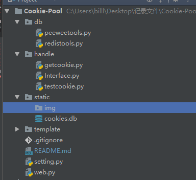
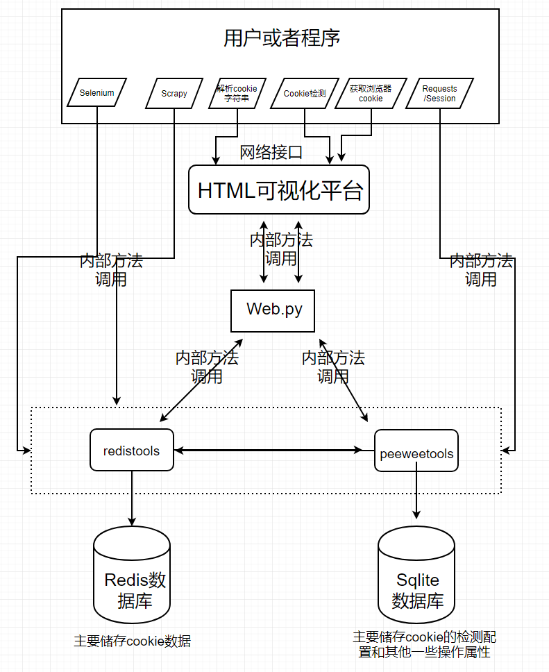
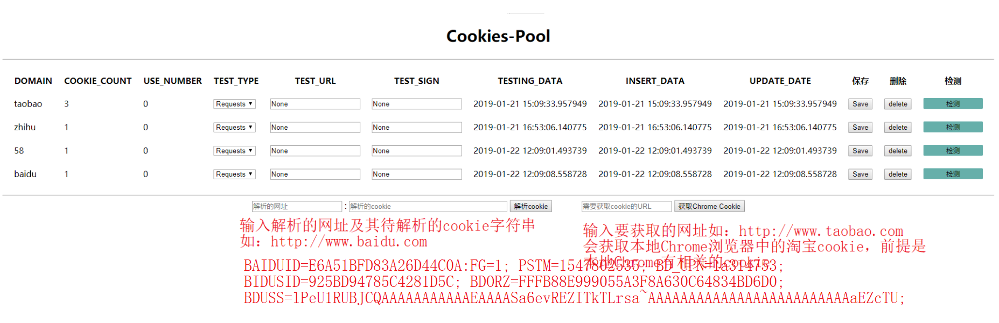
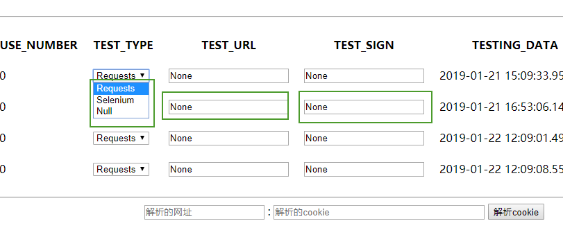
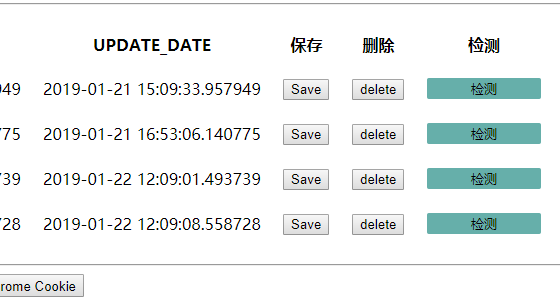
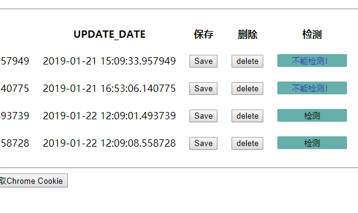
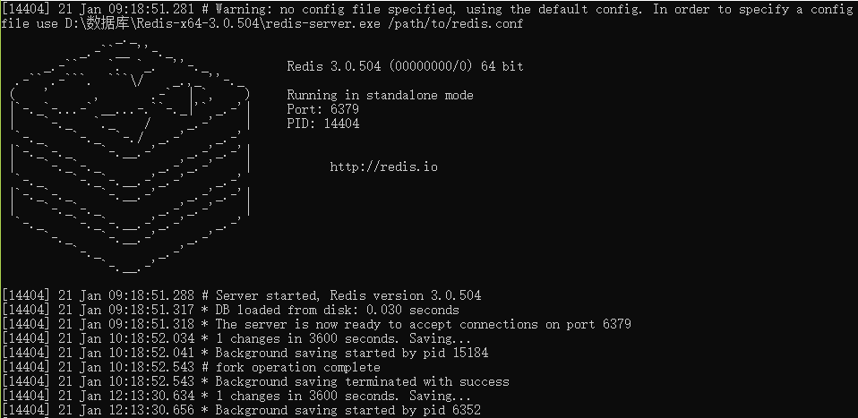
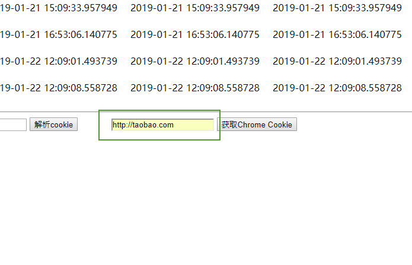
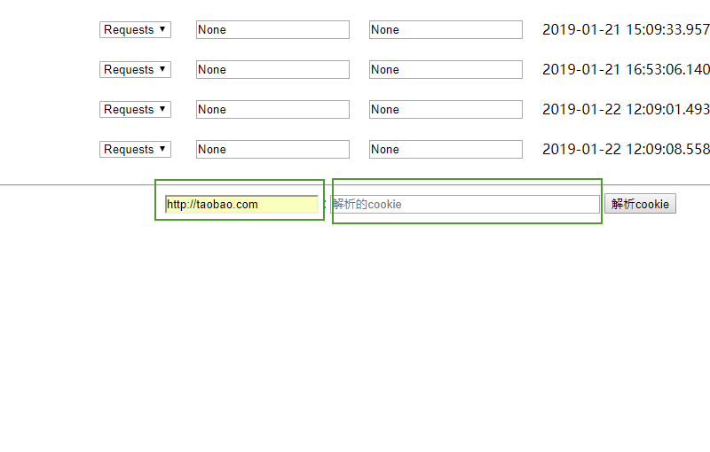
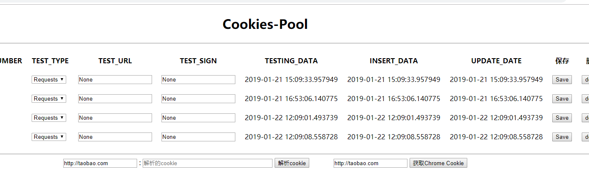

# Cookie-Pool
一个强大的Cookie池项目，超乎你的想象

## 1 综述
随着大型网站反扒机制的增强，使用cookie登陆已经成为一种最高效的方式，为此打造一款超强cookie池项目<p>
基于tornado网络框架，综合了<B>selenium、requests、Session、scrapy、cookie字符串、浏览器cookie</B><p>
把六中来源的cookie统一为一种格式，并通过tornado开发的控制台，来提供cookie检测设置和可视化<p>

本项目分为cookie获取部分、存储部分、可视与中控部分、预留自动登录获取部分

## 2 文件目录结构说明

### 2.1 db
peeweetools:封装了操作sqlite的基本方法和函数<p>
redistools: 封装了redis的基本方法和函数
### 2.2 handle
getcookie:封装了从本地浏览器、requests、session、webdriver、cookie字符串中获取cookie的方法<p>
interface:封装了协调调用sqlite、redis的方法，是在peeweetools、redistools的基础上再次封装主要实现存放cookie和获取cookie的函数
testcookie：定义了用于测试cookie的类
### 2.4 static
静态文件目录，存放sqlite
### 2.5 template
可视化的html模板文件，用于tornado渲染
### 2.6 setting.py
配置文件
### 2.7 web.py
主程序文件，实现调度和网页操作、后台操作的相关接口
### 2.8 requirements.txt
项目涉及到的Python包，使用pip install -r requirements.pip命令自动安装<p>
安装browsercookie失败的话请使用anaconda Python解释器自带了这个包

## 3 架构说明

<p>
用两种方式与用户交互：1.条用web接口 2.调用内部方法<p>
selenium、requests、Session、scrapy的cookie存放目前只能通过调用内部方法<p>
获取Chrome浏览器cookie，解析cookie字符串可通过在线操作和内部方法来实现

## 4 前端视图


4.1 配置检测方式：selenium、requests<p>
    检测的URL、打开URL后标志性的字段<p>


4.2 配置检测之后点击保存，然后可以检测了<p>


如果没有配置检测方式及其字段是不能够检测的<p>


<p>
4.3 **检测原理：**<p>
通过打开我们配置的url地址检测在url地址中只有登陆后才能出现的字段如：用户名、账号名<p>
所以配置的URL最好是登陆后才可见的地址<p>
4.4 **多账号配置**<p>
如果是多条cookie，分别对应多个账号，但是有多个用户名，这种方式下我们可以把所有用户名<p>
以英文;连接起来（如：张三;李四;老王）,后台会以;分割sign字段，在每个cookie页面都作为关键词检测<p>
如果含有其中一个那么就是可用的cooker，否则就是失效的cookie。

## 5 Redis、SQLite
### 5.1 Redis
是使用的本地Redis数据库，在window下下载redis——sever.exe服务端打开即可<p>
也可在setting.py文件中修改REDIS_URL地址为远程Redis地址
### 5.2 SQL
本项目使用的是SQLite数据库，也可换成mysql<p>
将db/peeweetools.py文件中的<p>
blog = PooledSqliteDatabase('static/cookies.db')修改为PooledMySQLDatabase<p>
具体配置看文档

 

## 6 使用方法
### 6.1 启动
在环境配置好的前提下，运行web.py文件，即可启动
### 6.2 存放cookie
#### 6.2.1 存放selenium的cookie

```python
from selenium import webdriver
from handle.Interface import put_cookie

url = "http://www.baidu.com'
driver = webdriver.Chrome()
driver.get(url)
data = driver.get_cookies()
put_cookie(url, data)
```
此时selenium的cookie就放到了Redis，在redis中的key是cookies：domain格式<p>
### 6.2.2 存放本地Chrome中的cookie
运行web.py之后打开http://localhost:端口/<p>
在获取cookie框中填入网址<p>
<p>
或者通过调用内部方法
```python
from handle.getcookie import get_chrome_cookie
from handle.Interface import put_cookie

url = "http://www.taobao.com"
cookie_list = get_chrome_cookie(url) # 返回淘宝的cookie列表
put_cookie(url, cookie_list)
```
### 6.2.3 存放requests/Session的cookie
向get_reque_session_cookie函数中传入response对象将解析cookie
```python
import requests
from requests import Session
from handle.Interface import put_cookie
from handle.getcookie import get_reque_session_cookie

url = "http://www.taobao.com"
response = requests.get(url)
session = Session.get(url)
cookies = get_reque_session_cookie(response)
cookies = get_reque_session_cookie(session) 
put_cookie(url, cookies)
```
### 6.2.4 存放scrapy的cookie
使用方法大致同获取requests/Sessioncookie的方法一致<p>
将scrapy的response对象传入get_scrapy_cookie函数

### 6.2.5 存放cookie字符串
```python
from handle.Interface import put_cookie
from handle.getcookie import get_text_cookie

url = "http://www.baidu.com"

str = """REALTIME_TRANS_SWITCH=1; FANYI_WORD_SWITCH=1; HISTORY_SWITCH=1; 
        SOUND_SPD_SWITCH=1; SOUND_PREFER_SWITCH=1; to_lang_often=%5B%7B%22value%22
        %3A%22en%22%2C%22text%22%3A%22%u82F1%u8BED%22%7D%2C%7B%22value%22%3A%2
        2zh%22%2C%22text%22%3A%22%u4E2D%u6587%22%7D%5D; from_lang_often=%5B%7B%2
        2value%22%3A%22zh%22%2C%22text%22%3A%22%u4E2D%u6587%22%7D%2C%7B%22value%2
        2%3A%22en%22%2C%22text%22%3A%22%u82F1%u8BED%22%7D%5D; Hm_lvt_64ecd82404c5
        1e03dc91cb9e8c025574=1546396967,1548035203; BAIDUID=E6BB8BCF4B51CC6A516F391
        20FB9580F:FG=1; PSTM=1548043541; BIDUPSID=A4BC9C784FA26726086F330B96C55BA1;
         ZD_ENTRY=baidu; delPer=0; locale=zh; BDORZ=B490B5EBF6F3CD402E515D22BCDA1598;
          Hm_lpvt_64ecd82404c51e03dc91cb9e8c025574=1548057039; PSINO=3; BDRCVFR[qQNS-
          g6pS-_]=mbxnW11j9Dfmh7GuZR8mvqV; H_PS_PSSID=26523_1456_21118_28329_28132_26
          350_28266_27245"""
cookies = get_text_cookie(url, str)
put_cookie(url, cookies)
```
或者在html页面操作：<p>


## 6.3 获取cookie
### 6.3.1 通过接口获取cookie
```python
import requests
url1 = 'http://localhost:端口号/random?url=网址'  # 随机获取一条该域名的cookie
url2 = 'http://localhost:端口号/all?url=网址'  # 返回该域名的所有cookie

cookies = requests.get(url1)

```
### 6.3.2 通过内部方法获取cookie
```python
from handle.Interface import get_cookie

url = "http://www.taobao.com"
cookies = get_cookie(url) # 返回所有cookie
```
## 6.4 cookie的检测
### 6.4.1 配置检测信息
在检测之前需要配置相关的信息<p>

TEST_TYPE:检测类型，是通过requests打开配置的URL还是通过selenium打开<p>
TEST_URL：含有验证信息的页面地址如：登录页、个人资料页面<p>
TEST_SIGN：鉴别有效cookie的字段如用户名等,多个cookie的不同字段用英;连接起来<p>
三个字段必须配置，不配置不能保存；配置后点击保存，然后再点击检测。

# [项目github地址](https://github.com/dhfjcuff/Cookie-Pool),觉得不错就给个星星吧


